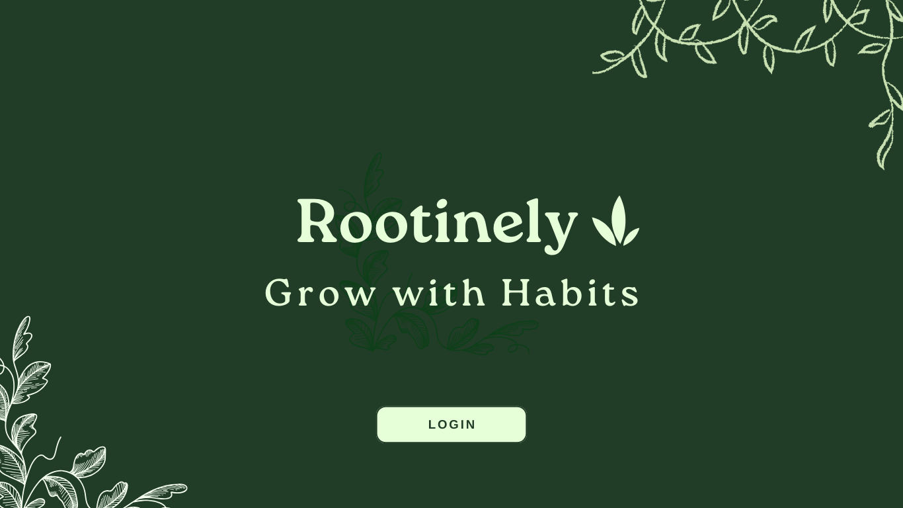
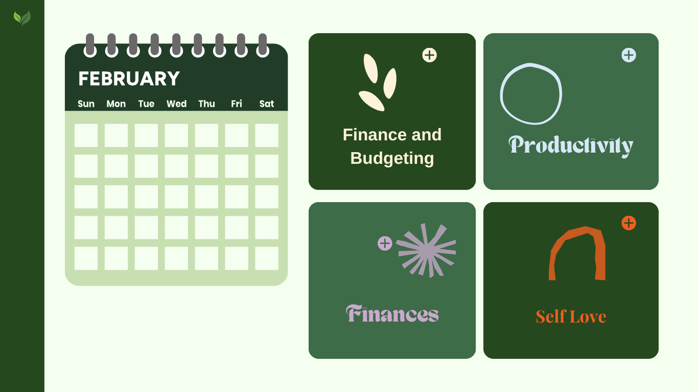

# 🌱 Rootinely - Grow with Habits

## Overview

**Grow with Habits** is a **habit-tracking site** with a **cute aesthetic** that helps users stay consistent with their goals.  
As users complete habits, their **plant grows**, and they can **leave messages for their future selves** in a **time capsule** that unlocks over time.

This site makes habit tracking **fun, rewarding, and personal**, encouraging long-term engagement through **gamification and self-reflection**.

## Problem Space

Many habit trackers are **boring, overwhelming, or purely functional**. Users often **lose motivation** because there's no **immediate reward** for tracking habits.

This site **solves that problem** by:  
✅ Using **gamification (growing plant)** to create **instant gratification**.  
✅ Adding a **time capsule** feature for **self-reflection and future motivation**.  
✅ Keeping users **emotionally invested** with a **cozy, aesthetic design**.  
✅ Providing **emotional support via a chatbot**.  
✅ Offering **data-driven insights with Tableau** to track habits effectively.

## User Profile

### 🎯 Target Audience

- People who want to **build better habits** but struggle with consistency.
- Users who enjoy **self-care, journaling, or cozy productivity apps**.
- Gamers or casual users who like **cute and interactive rewards**.
- Those who benefit from **habit analytics & progress tracking (Tableau feature)**.

### 💡 How They’ll Use It

- **Daily habit tracking** (checking in on completed habits).
- Watching their **plant grow** as they stay consistent.
- **Writing time capsules** to unlock in the future.
- **Talking to the chatbot** for encouragement when feeling unmotivated.
- **Comparing progress with friends** using the multiuser feature (future idea).

### 🌿 Special Considerations

- The site must feel **positive and rewarding** (no harsh punishments for missing habits).
- Aesthetic must be **cute and cozy** (soft colors, rounded UI, smooth animations).
- It should be **easy to use** and **not overwhelming**.
- Data visualization should be **simple and actionable** using Tableau.

## Features

### 🎯 MVP Features (Minimum Viable Product)

✅ **Habit Tracker** – Users can add, complete, and track habits.  
✅ **Plant Growth System** – The plant grows **based on streaks**.  
✅ **Time Capsule Feature** – Users write notes for their **future selves**, unlocking them after a set period.  
✅ **Daily Streak Tracking** – Encourages consistency.  
✅ **Tableau Integration** – Shows habit progress visually.  
✅ **Chatbot Feature** – Provides positive reinforcement and motivation.  
✅ **Multiuser Support** – Users can **view & encourage** friends' progress.

## Implementation

### 🖥️ Tech Stack

 
   

#### Frontend

- React (for UI & state management)
- SCSS (for styling)
- Framer Motion (for smooth animations)

#### Backend & Database

- Node.js – Backend runtime environment for handling API requests.
- Express.js – Fast and lightweight framework for building REST APIs, including the chatbot and authentication system.
- Knex.js – SQL query builder for managing structured habit-tracking data.
- JWT (JSON Web Token) – Secure user authentication via token-based authentication.
- Bcrypt.js – Hashing passwords for security before storing them in the database.
- Gemini API – AI-powered chatbot for motivation and encouragement.

#### Data & Analytics

- Tableau (for habit tracking insights & data display)

#### Other Libraries

- Lottie / Rive (for cute animated plant growth)
- LocalStorage (to cache data and reduce database reads)

### APIs

🔹 **LottieFiles API** – Animated plant growth effects.  
🔹 **Web Speech API (Optional)** – If adding voice notes for the time capsule.  
🔹 **Gemini API** – Chatbot functionality.  
🔹 **Tableau REST API** – Data visualization for progress tracking.

### **Sitemap**

1️⃣ **Home Page** – Shows user’s plant, habits, and progress.  
2️⃣ **Habit Tracker Page** – Add, complete, and manage habits.  
3️⃣ **Time Capsule Page** – Write a note, set an unlock date, and track past capsules.  
4️⃣ **Chatbot Page** – Talk to an AI-powered support bot for motivation.  
5️⃣ **Dashboard Page (Tableau Integration)** – Displays progress insights.  
6️⃣ **Profile Page** – Customize UI, see streak history, settings.  
7️⃣ **Login Page** – Allow user to login.
8️⃣ **Register Page** - Allow users to register

## **Mockups**

Landing Page:
&nbsp;

Home Page:
&nbsp;

## **End Points**

### 📡 Authentication Endpoints

| Method   | Endpoint    | Description                          |
| -------- | ----------- | ------------------------------------ |
| **POST** | `/register` | Registers a new user                 |
| **POST** | `/login`    | Logs in a user and returns JWT       |
| **GET**  | `/profile`  | Fetches the logged-in user's profile |

### 🌿 Habit Tracking Endpoints

| Method    | Endpoint               | Description                       |
| --------- | ---------------------- | --------------------------------- |
| **GET**   | `/habits`              | Get all habits for the user       |
| **POST**  | `/habits`              | Add a new habit                   |
| **PATCH** | `/habits/:id/complete` | Mark habit as completed for today |

### 🎁 Time Capsule Endpoints

| Method   | Endpoint           | Description                       |
| -------- | ------------------ | --------------------------------- |
| **POST** | `/timecapsule`     | Save a new time capsule           |
| **GET**  | `/timecapsule`     | Fetch user's time capsules        |
| **GET**  | `/timecapsule/:id` | Retrieve an unlocked time capsule |

### 💬 Chatbot Endpoints (Gemini API)

| Method   | Endpoint           | Description                      |
| -------- | ------------------ | -------------------------------- |
| **POST** | `/chatbot`         | Get a response from the chatbot  |
| **GET**  | `/chatbot/history` | Fetch past chatbot conversations |

### 👥 Multiuser & Social Endpoints

| Method   | Endpoint          | Description             |
| -------- | ----------------- | ----------------------- |
| **GET**  | `/friends`        | Get list of friends     |
| **POST** | `/friends/add`    | Send a friend request   |
| **POST** | `/friends/accept` | Accept a friend request |

### 📊 Data & Visualization Endpoints (Tableau)

| Method  | Endpoint    | Description                        |
| ------- | ----------- | ---------------------------------- |
| **GET** | `/progress` | Get user’s habit stats for Tableau |

## 📊 Data & Relationships

The database consists of **six tables**, with structured relationships between users, habits, time capsules, chatbot interactions, and friendships.

### 🔗 Table Relationships:

- **Users ↔ Habits** → One user can have **many habits** (`One-to-Many`).
- **Habits ↔ Habit Log** → Each habit has a log of **completion records** (`One-to-Many`).
- **Users ↔ Time Capsules** → One user can create **many time capsules** (`One-to-Many`).
- **Users ↔ Chatbot Conversations** → Each user has **multiple chatbot interactions** (`One-to-Many`).
- **Users ↔ Friends** → Users can **send & receive** friend requests (`Many-to-Many`).

## 📅 Roadmap - Sprint Plan (3 Weeks)

### Week 1 – Core Features, Setup & Gamification

✅ Set up **React, Knex.js, and authentication (JWT + Bcrypt)**  
✅ Create **habit tracking UI**  
✅ Implement **basic streak logic**  
✅ Set up **chatbot backend (Gemini API) using Express.js**  
✅ Configure **database using Knex.js with MySQL**  
✅ Develop **plant growth system with Lottie / Rive animations**

### Week 2 – Data Visualization, Multiuser, Testing & Final Features

✅ Connect **habit streaks to plant evolution**  
✅ Integrate **Tableau for habit insights & progress tracking**  
✅ Store **habit & chatbot interaction data in MySQL (via Knex.js)**  
✅ Add **multiuser system** (friends & social support features)
✅ Implement **secure API endpoints with JWT authentication**  
✅ **Bug fixes & final UI adjustments**  
✅ **Prepare demo & user testing**

## Future Implementations

**If time allows, future updates may include**:  
🌸 Customizable plant pots & themes  
🐦 Unlockable creatures (butterflies, fireflies, etc.)  
🛠 Habit challenges with friends  
🌿 Allowing users to visit each other garden and leaving messages
📷 AR mode to see your plant in real life

